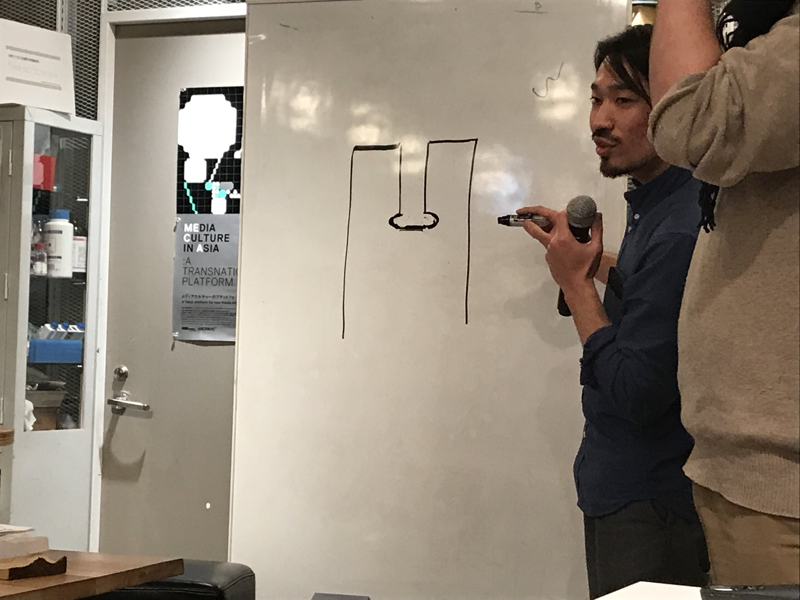
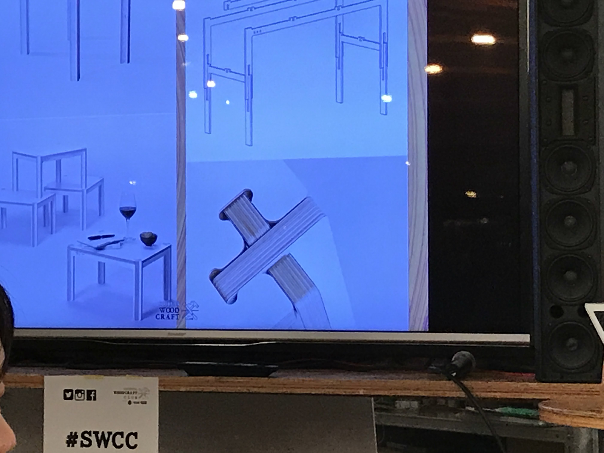

# 180207

### 金岡さん

CNC Milling Machine  
Computer Numerical Control

CAM で、色々な設定をして、 g code を作成、それを書き出して、CNC を走らせる。  

切断、切削（彫り込み）、穴あけなど  

CNC の特徴  
- 厚い板を加工できる（今回は、24ミリ厚の合板）  
- エンドミルの種類で様々な加工  
- 回転数、送り速度など、様々な素材  

CNC でできないこと
- 3軸 CNCでは、2.5次元加工なので、アンダーカット不可（位置を合わせる処置で、表と裏、別々に加工）
- 入隅（円形のエンドミルの太さ分、角に入ることができない = 直角不可）  

### 田中さん

材料の種類  
- 無垢材  
- 集成材（小さな無垢材を接着）  
- 合板（薄い板を向きを交互に積層） ← 今回はこれ  
- ランバーコア（集成剤を芯材に、両面に仕上げ材）  
- MDF（木の繊維を固めた紙のようなもの）  
- ポリ合板（合板などの表面にポリエステル樹脂）  

仕上げ（塗装）の種類  
- オイル（濡れ色になる）  
- ワックス（濡れ色になりにくい）  
- ウレタン（強い塗膜、ツヤツヤ）  
- ニス（塗膜）  
- オイルステン（木材に染み込ませて色をつける、この上にオイルなど）  
- ペンキ  
- ソープフィニッシュ（洗剤で拭いて、毛ばたちを軽く矢する。白さを保てる。上の仕上げと違い保護にはならない。機構が乾燥している北欧ではこれが主流）

組手、仕口
- 相欠き
- ほぞ組み
- あられ組み
- 積層圧着

※ CNC の入隅のように、直角は作れないので、エンドミルを逃す部分を作る

