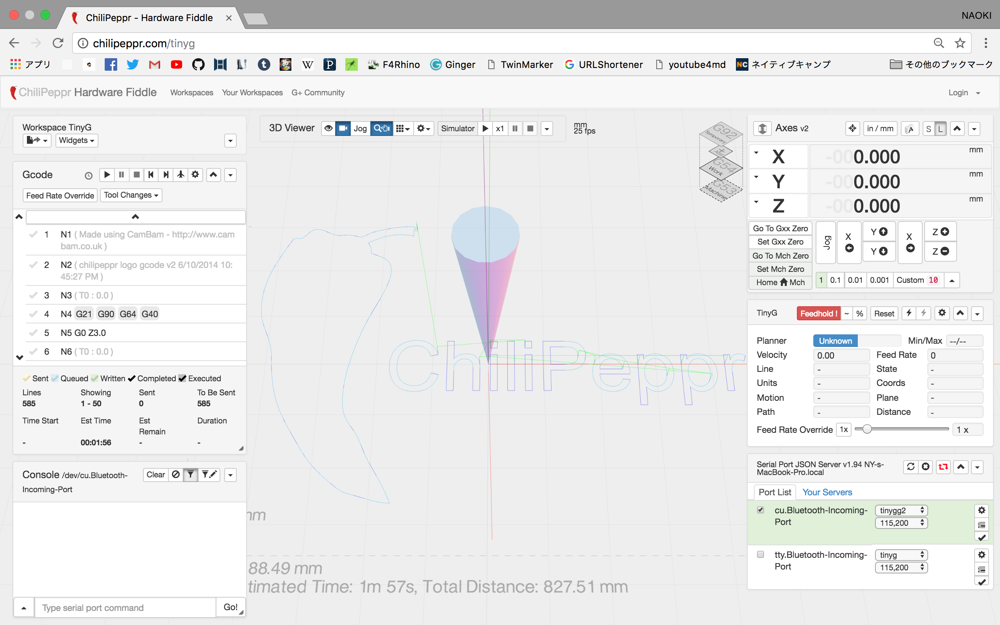
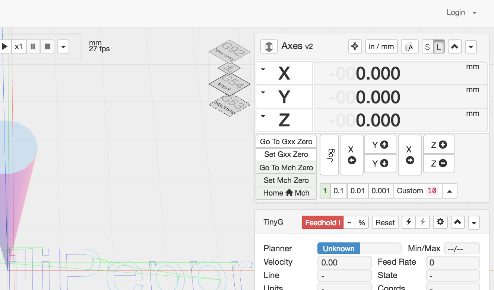
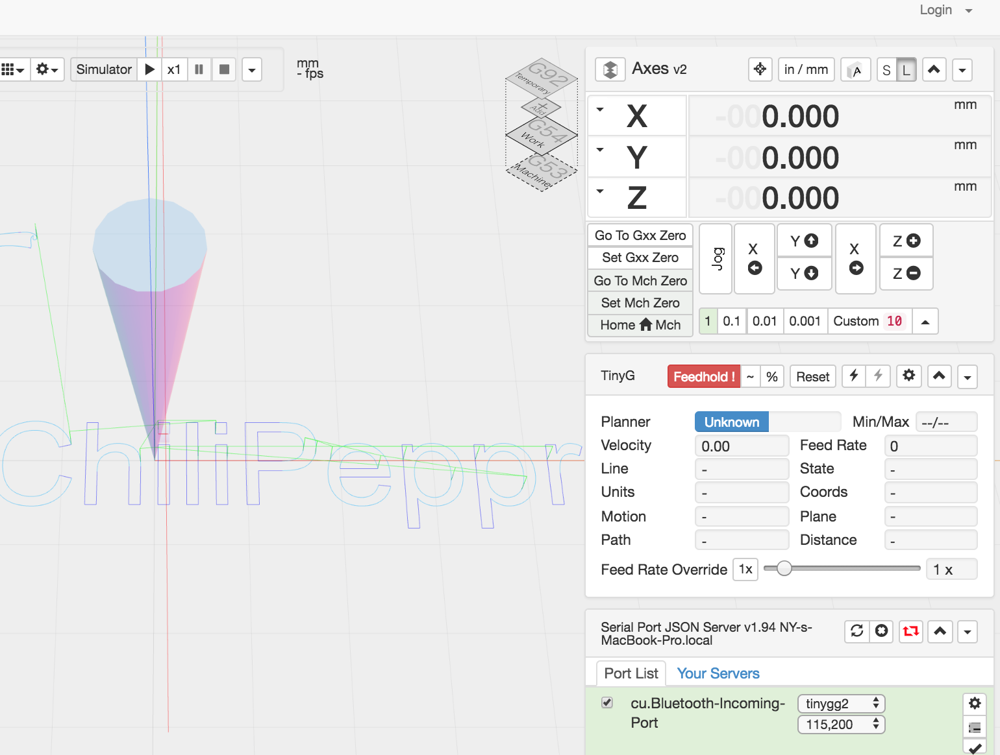
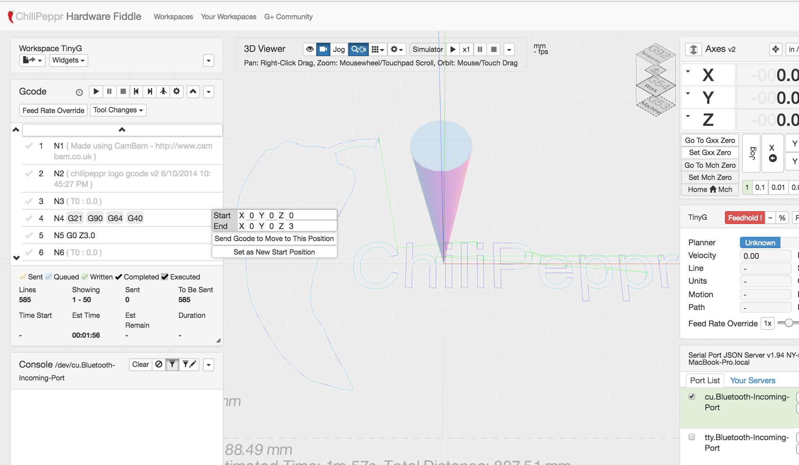

# 後でちゃんと書きます  
---  

# Chilipeppr  

Chilipeppr とは、 r7 CNC を制御するためのオンラインツール  

これに、Fusion360 の CAM から書き出した g code を読み込んで、加工原点等の指定を行なって Run で加工開始。  

---  

### how to use  

##### (1) json-server の実行ファイルを起動（プロンプトが立ち上がる）  

PC に入れてない場合は、ここから落とせる（[→](https://github.com/chilipeppr/serial-port-json-server/releases)）  

##### (2) ブラウザから Chilipeppr にアクセスする。

※ ブラウザは Firefox が良さそう、Microsoft Edge だとダメかも  
[http://chilipeppr.com/tinyg](http://chilipeppr.com/tinyg)  

  

##### (3) PC と A-B USB 経由で、CNC のボードに接続する。  

右下の接続のところでチェックを入れると接続。  

接続がうまくできると、右側中段の TinyG のパネルに、今の CNC のステータスが表示される。  

##### (4) g code をドラッグ&ドロップ  

読み込んだところで、加工時間が一応見れる  

##### (5) 加工原点を設定する  

実物の物体と、作業用の XYZ を合わせて、そこを "Set Machine Zero" で指定する。  
ここの原点は、なんらかの方法で記録するのが良さそう。（材料にペンで書くとか）  

  

##### (6) エンドミルを回して Run で切削開始  

左上の g code のパネルの Run のマークをクリックしてスタート。  
緊急停止するときは、右側の TinyG のパネルの Feedhold!  

---  

### エラーでの一時停止について  

本体が停止して CNC 側に乗っている制御ボードの赤色 LED が点滅しているときはエラー。  

リセットボタンを押す前に、 Chilipeppr の方で、 g code のキャッシュを消す。消さないと、リセットボタンを押した瞬間に、走り出して危ない。  

右側の TinyG のパネルで、% でキャッシュを消す。  
左側のコンソールパネルで確認  

  

---  

### エラーで停止した時にの時に g code で復旧させる方法（怖いのであまりやりたくないかも）  

左側の g code のパネルで、確実に終わっている行で確実に終わってる行を探す。  

その行で右クリックで、"Send g code to Move to This Position"、これでこの行のこの地点にまっすぐ移動する（この操作も要注意）  

その行まで行ったら、"Set as New Start Position"、これでこの行からスタートできる状態になるので、 Run  

  

---  

### エラーの原因（？）  

わかりやういエラーとして XY は、マシンの可動域から外れるとエラーが出る。  
Z は出ないので要注意。  

右側中段の TinyG のパネルに、今の CNC のステータスが表示されているが、  
負荷の項目ないように見える  

負荷が大きくなって止まるという概念がない？  

数値が変動するステータスの項目  
- Planar  
- velocity = 速さ  
