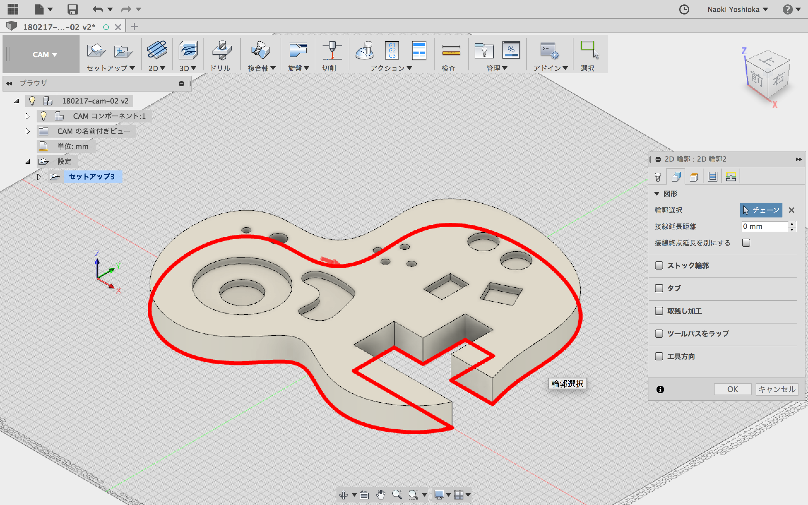
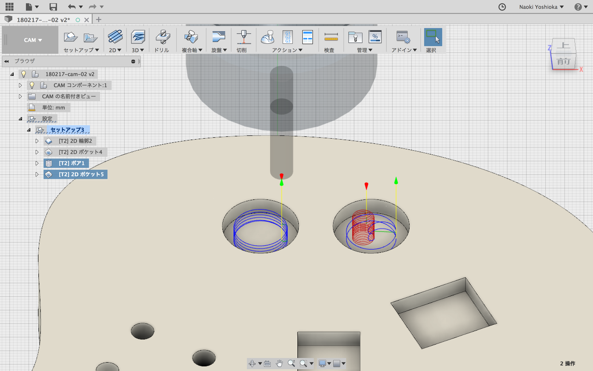
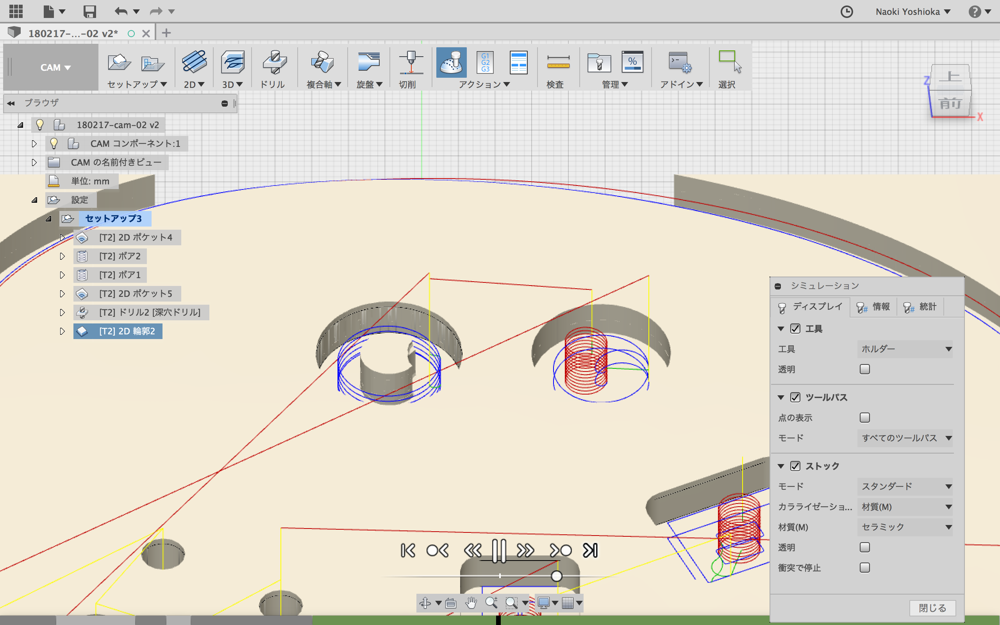
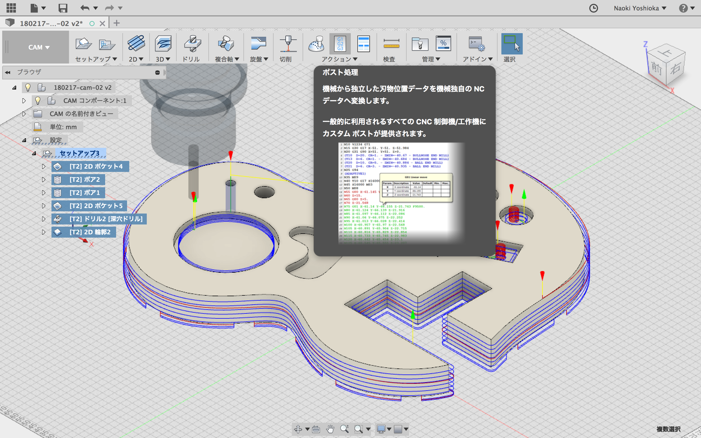

# Fusion360-CAM  

Fusion360 の CAM の設定  
- 設定  
- 切断  
- ボア加工とポケット加工の違い  
- g code の書き出し  

---

##### 設定  

「セットアップ > 新しいセットアップ」  

ワーク座標系  

ここで指定した原点を元に、g code の座標が計算される。  
デフォルトでは、モデルのバウンディングボックスの中心。  
右上や、右下などが良さそう。  

また、切り出す部材と関係ないところに、ドリル加工の穴を用意して、その中心を原点にしてあげると、機械が止まって、マシンの原点の設定が吹っ飛んでも復旧できそう。

---  

##### 切断

「2D > 2D 輪郭 / 2D Contour」  

---  

##### ボア加工とポケット加工の違い  

「2D > ボア」  
「2D > 2D ポケット」  

---  

##### g code の書き出し  

「アクション > ポスト処理」  

---  

