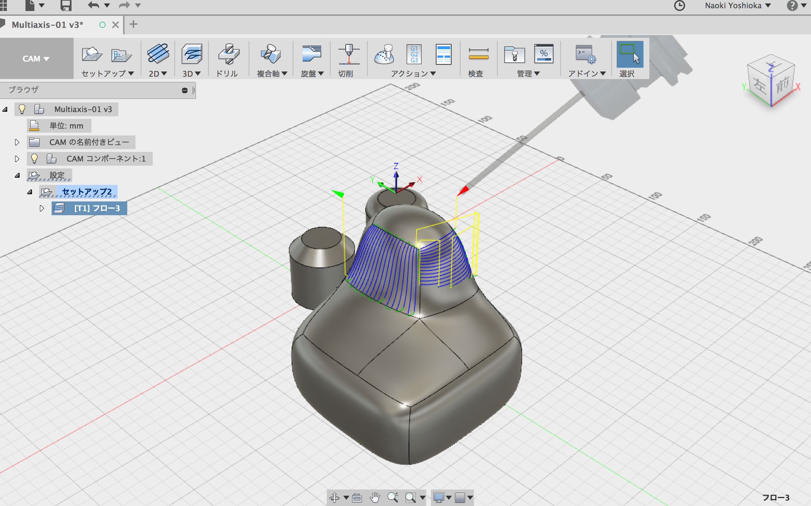
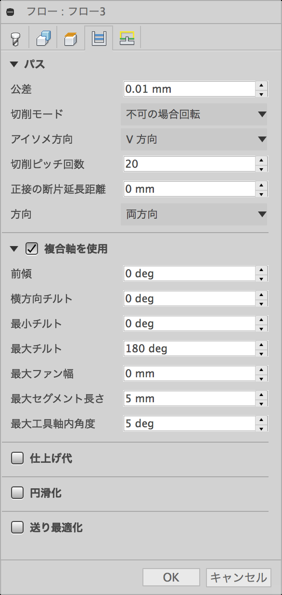

# Multiaxis  

3軸以上の切削、3+2軸加工機や、ロボットアームのようなもの向けの多軸切削。  

Fusion360 の CAM の多軸機能は、この3つ  

- スワーフ  
- 複合輪郭軸  
- フロー（これかな）  

---  

### スワーフ  

flat surface のみっぽい  

  

### 複合軸輪郭  

エッジしかできないように見える  

### フロー  

エンドミルの先で削る、面と法線ベクトル的な  

  

Brep からのパス出しは、若干できてきてる  

  

##### パスの設定のタブ  

複合軸を使用にチェック  
ここで、パラメータを機械の可動域に合わせて詰める  

走査の細かさは、切削ピッチ回数  
uv のどっちか選べる  

   

---  

Brep → CAM → g code  
Mesh → CAM → g code  

3軸のパス出しでも、後者がちょっと面倒で（一周分のエッジとか選ぶことができないので、ポリゴンの頂点を手動でやるしかない）、  
これは、5軸においても多分そう。  

---  

そのほか、多軸とかできるとか書いてる CAM はこの辺  
- ~~Autodesk HSM (Ultimate)~~  
- FFCAM / STLCAM

見てみる  
