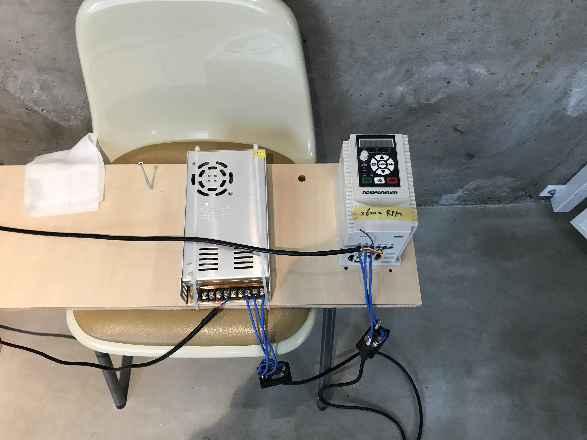
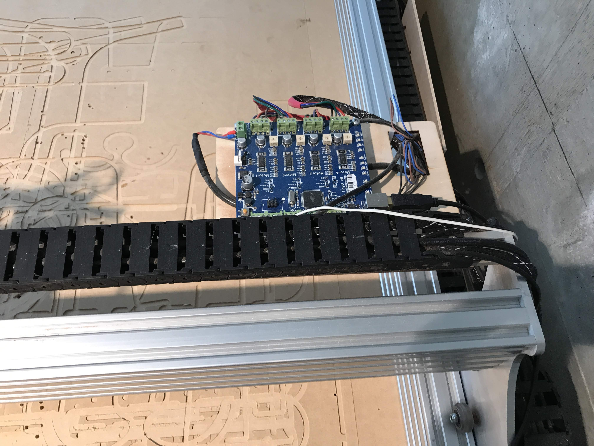
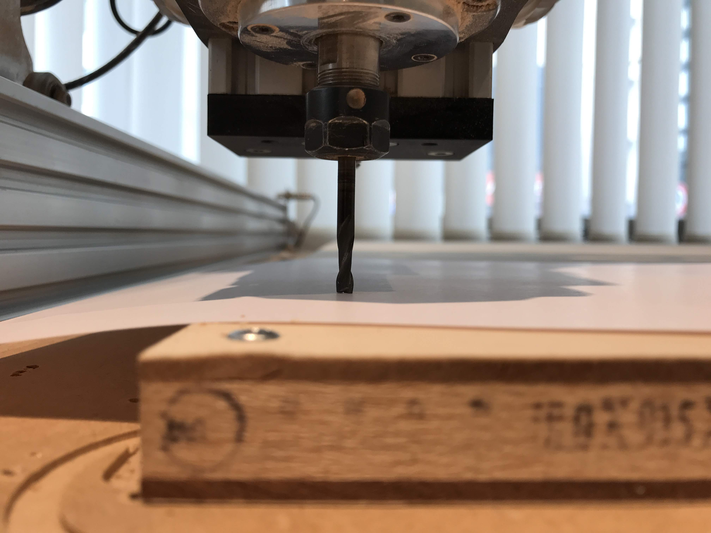
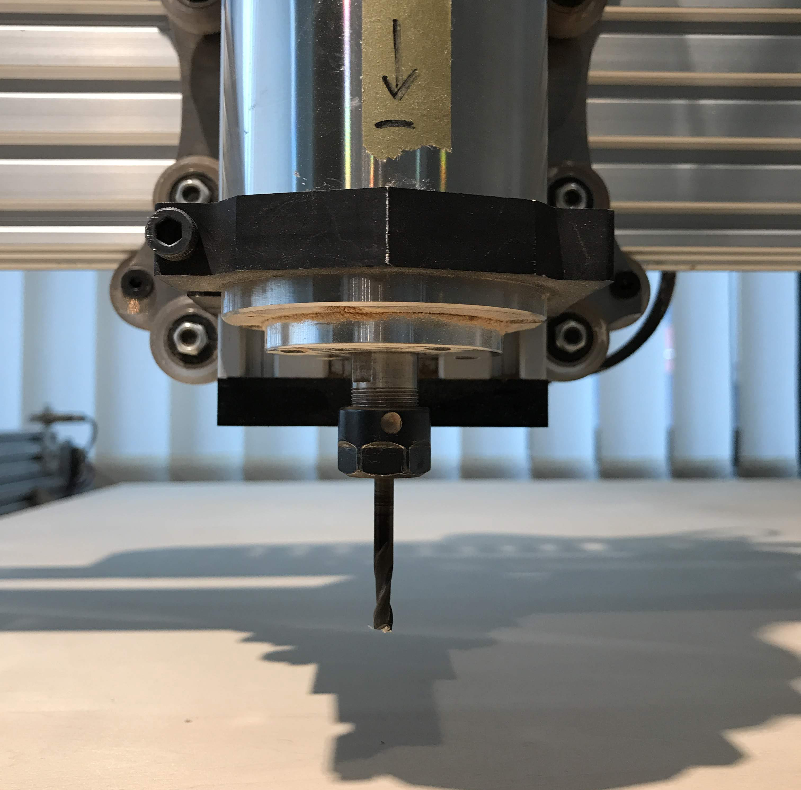

# r7-CNC

- 電源接続  
- 制御ボードとパソコンの接続  
- 切削原点の設定  
- エンドミルの交換  

r7 CNC の使い方等、書きます

---  

### 電源接続  

電源ユニットx2 をコンセントに繋ぐ  

---  

### 制御ボードとパソコンの接続  

PC と USB A-B ケーブルで接続  

  

json-server を建てた後、Chilipeppr にアクセス（ [http://chilipeppr.com/tinyg](http://chilipeppr.com/tinyg)）  
右下の接続のパネルでチェックを入れて接続  

  

---  

### 切削原点の設定  

XY と Z（大事）  

Z は、紙を挟んで材料の高さと合わせる  

---  

### エンドミルの交換  

13ミリのレンチ + 17ミリのレンチで緩めて、交換。  
交換した後はきつく締める。  

  
